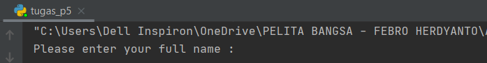
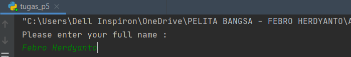

# Tugas Pertemuan 6 - Bahasa Pemrograman

Repository ini digunakan untuk memenuhi Tugas Bahasa Pemrograman - Pertemuan 6<br><br>
Nama : Febro Herdyanto <br>
NIM : 312010043<br>
Kelas : TI.20.B.1<br>

## Pertemuan 5 - Tugas

Pada pertemuan 5 Bahasa Pemrograman, saya diberi tugas oleh Dosen untuk membuat Aplikasi Biodata dengan Python (Seperti Gambar dibawah ini):
<br>
Saat ini saya akan menjelaskan hasil dari tugas tersebut.<br>
Berikut *source code* nya atau klik link berikut ( [Tugas 5 Python](tugas_p5.py) ): <br>
``` python
print("Please enter your full name : ")
fullname=input()
print("Please enter nickname : ")
nickname=input()
print("Please enter your NPM : ")
npm=int(input())
print("Please enter your place of birth : ")
pob=input()
print("Please enter your date of birth : ")
date=int(input())
print("Pleae enter your month of birth : ")
month=input()
print("Please enter year of birth : ")
year=int(input())
print("Please enter your phone number : ")
phone=int(input())
print("Please enter your address : ")
address=input()

dob=2020-year

print("\n\n Assalamu'alaikum. ")
print(f"Let me introduce my self. My name is {fullname}, but you can call me {nickname}. My NPM {npm}. I was born in {pob} and Iam {dob} years old. I am very glad if you want to invite my house in {address}. So don't forget to call me before with the number {phone}. \n\n Thank You ")
```
* Berikut penjelasannya :<br>
``` python
print("Please enter your full name : ")
```
Source code diatas berfungsi untuk mencetak hasil / output berupa " **Please enter your full name :** " (Seperti gambar dibawah ini)<br>
 <br>
* Untuk source code berikutnya adalah inputan atau membuat variable. seperti syntax dibawah ini :
``` python
fullname=input()
```
Keterangan : <br>
- Variabel adalah sebuah wadah penyimpanan data pada program yang akan digunakan selama program itu berjalan. Yang berfungsi sebagai variable dalam source code diatas adalah **fullname** . <br>
- Fungsi **input()** adalah untuk memasukkan nilai dari layar console di command prompt, lalu kemudian mengembalikan nilai saat kita menekan tombol enter *(newline)*<br>
<br>
Pada gambar diatas, hasil dari inputan tersebut berwarna *hijau*<br>
* 
